# SM2
## 项目简介
SM2是非对称加密算法

它是基于椭圆曲线密码的公钥密码算法标准，其秘钥长度256bit，包含数字签名、密钥交换和公钥加密，用于替换RSA/DH/ECDSA/ECDH等国际算法。可以满足电子认证服务系统等应用需求，由国家密码管理局于2010年12月17号发布。

SM2采用的是ECC 256位的一种，其安全强度比RSA 2048位高，且运算速度快于RSA。
### 密钥派生函数
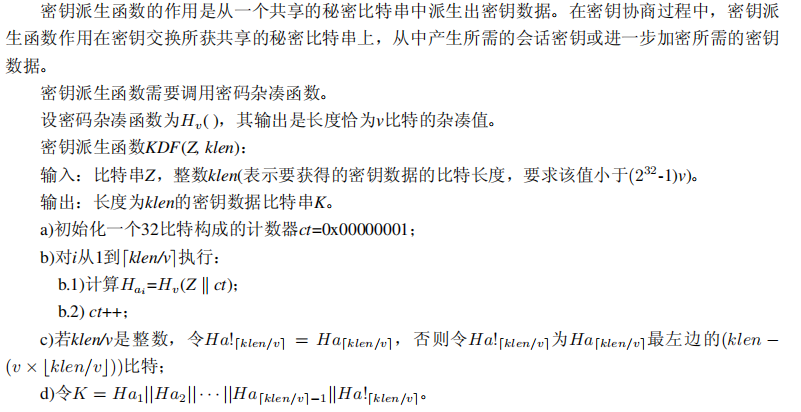
### 加密算法及流程
#### 加密算法
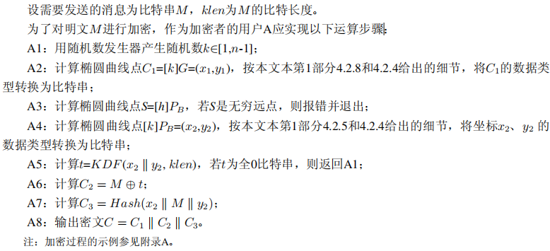
#### 加密算法流程
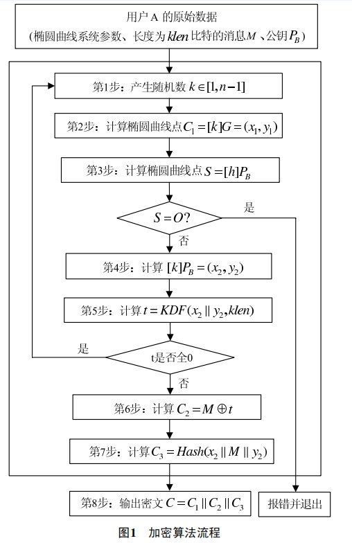
### 解密算法及流程
#### 解密算法
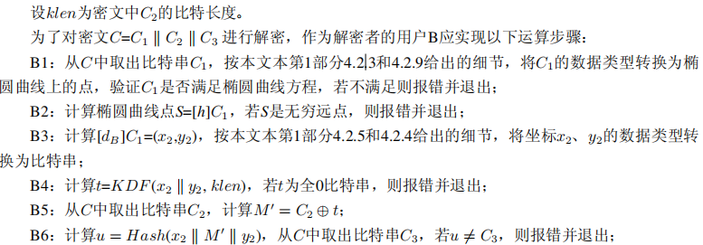
#### 解密算法流程
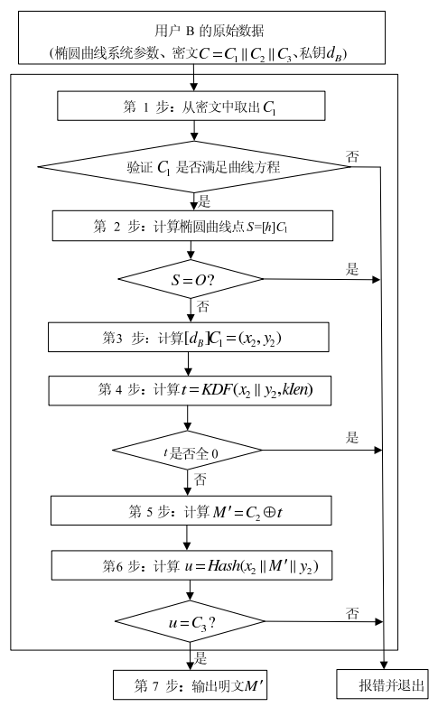
## 项目代码说明
### 模逆
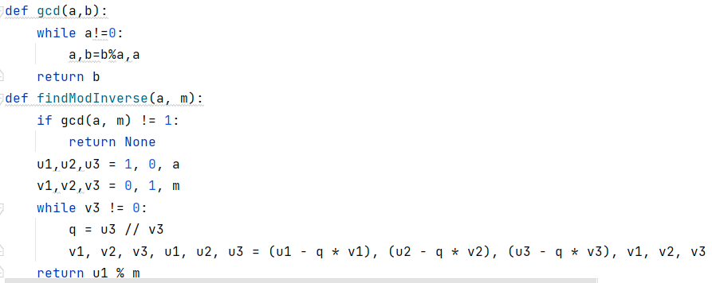
### 密钥派生函数
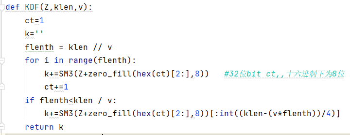
### 椭圆曲线运算
#### 自身相加
![img_7.png](img_7.png
#### 不同点相加
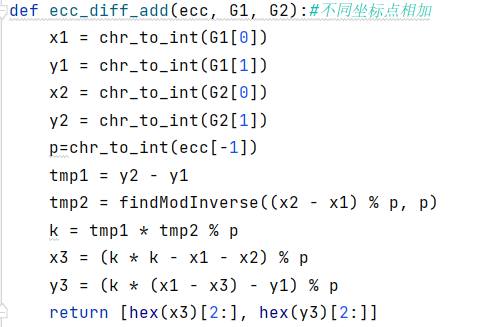
#### 和比自己大1的点相加
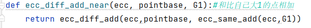
#### 乘法
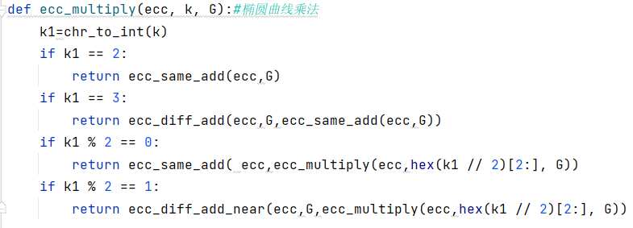
### 加密主函数
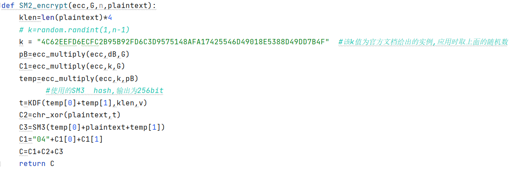
### 判断该点是否在曲线上
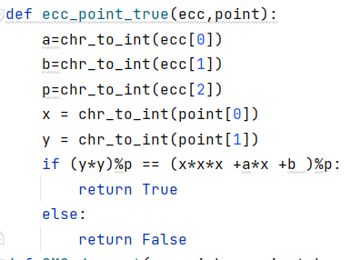
### 解密函数
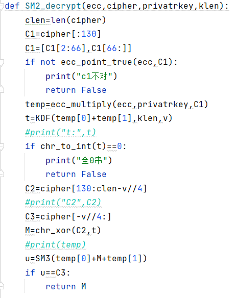
## 实验结果
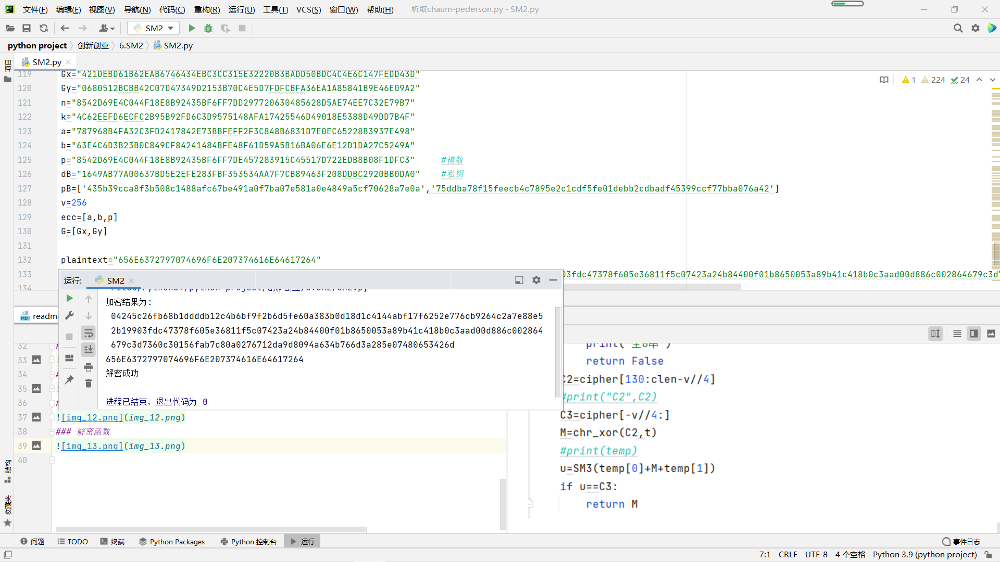
### 示例
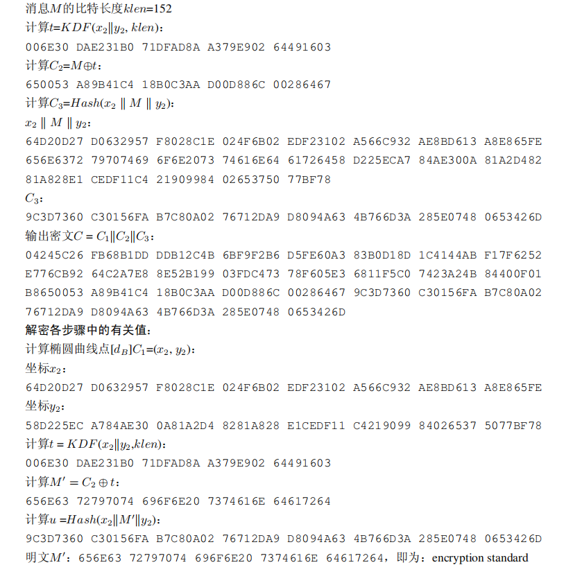
